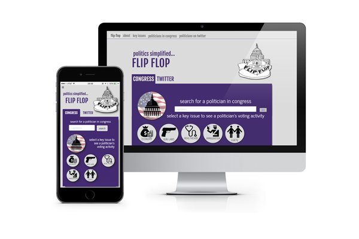

#[Flip Flop](http://www.flip-flop.org)

##about

Flip Flop was created to provide potential voters with a non-partisan platform containing essential information about political speech and political action. With this app, politicians’ congressional voting records and their tweets about key issues are at your fingertips.

Our goal is to make politics easy to follow, interesting and empowering. Make a more informed choice with Flip Flop today!

##visit the website
[www.flip-flop.org](http://www.flip-flop.org)

##the team behind flip flop

* [Calvin C. Ieong](https://github.com/icalving)
* [Chand Nirankari](https://github.com/chand)
* [Chris Praktish](https://github.com/cprakti)
* [Diana Ozemebhoya Eromosele](https://github.com/dianaeromosele)
* [Ted Bogin](https://github.com/tbogin)

##questions? comments?
[email us](mailto:chandnirankari@gmail.com)
